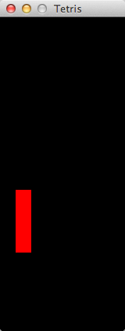

An attempt to whip out tetris in 5 minutes. 

Ran out of time.

Uses ruby and the gosu gem.

The first commit on this repo is the 5 minute progress.

TODO
---

* [ ] instead of checking input with a delay, record input as quickly as possible
    but simply respond to (act upon) the recorded input with a delay.
    that way button pressed won't be missed.
* [ ] rules for keeping score.
* [ ] rule for removing rows when cmopleted.
* [ ] rotation of peice.
* [ ] deal with peices of different sizes.
* [ ] collission detection bugs.
